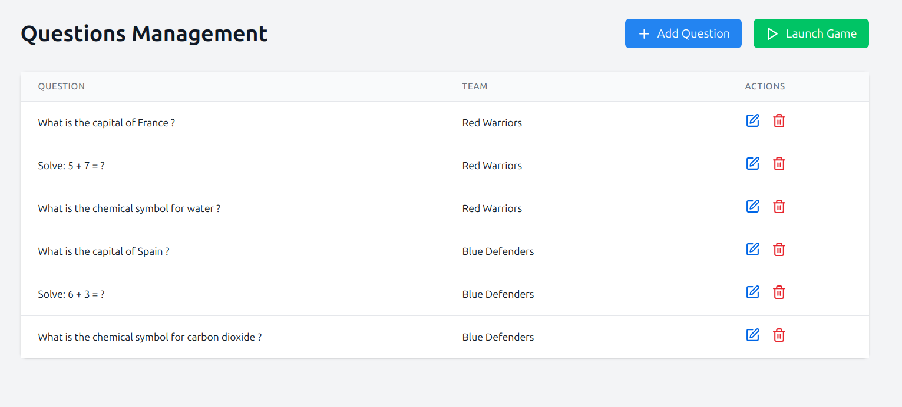
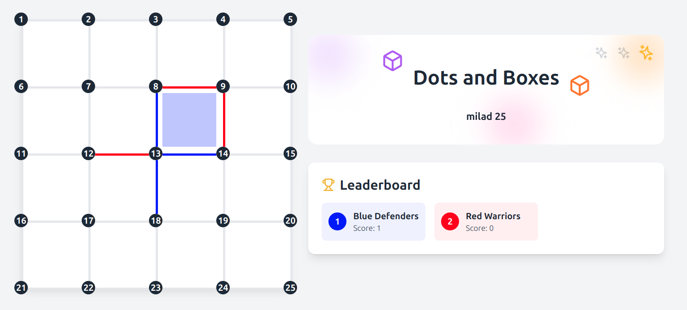
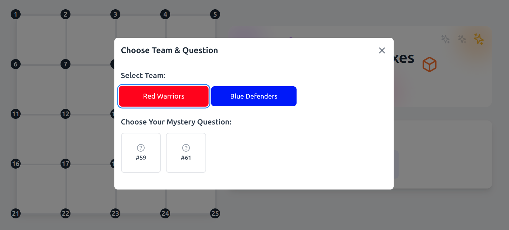
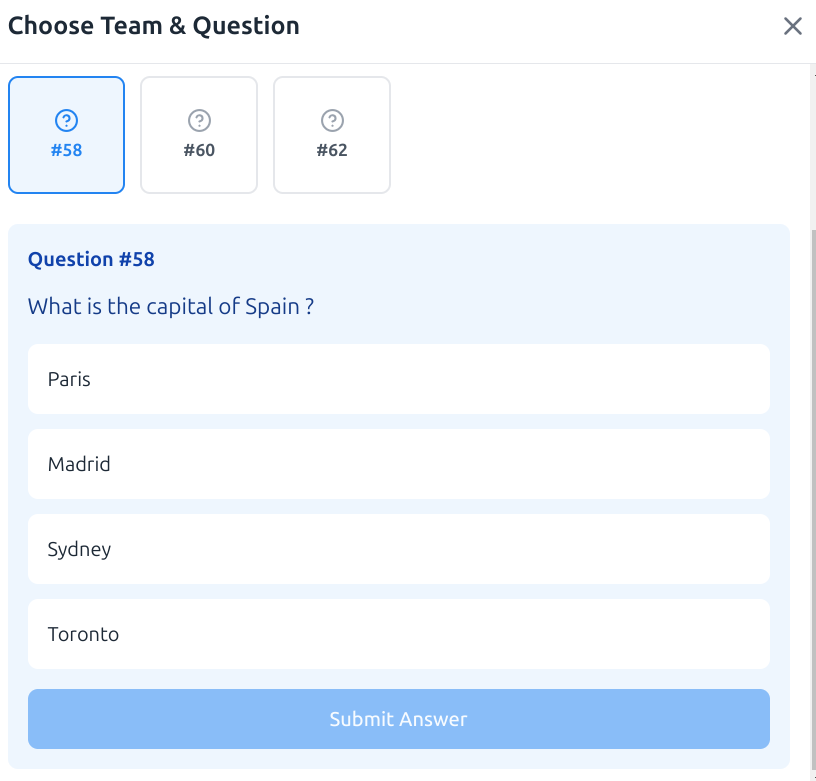

# Dots and Boxes Challenge

An interactive educational game that combines the classic Dots and Boxes game with a quiz system. Teams compete by answering questions correctly to draw lines and create boxes.

## Features

- 5x4 grid game board with numbered dots
- teams with unique colors
- Multiple-choice questions for each team
- Score tracking system
- Question history tracking
- MySQL database integration for persistent storage

## Tech Stack
- React 18 with TypeScript
- Vite for build tooling
- Tailwind CSS for styling
- Express.js for server-side rendering
- MySQL for data storage


## Installation and How to Run
Follow these steps to set up and run the project locally:

1. **Clone the repository:**

2. **Install dependencies:**
    ```sh
    npm install
    ```
3. **Configure the database:**
    - Create a new database in MySQL
    - Change the `.env` file credentials to match your database configuration:
    - Run the database schema:
    ```sh
    mysql -u <username> -p dots_and_boxes < schema.sql
    ```
4. **Run the server-side:**
    ```sh
    node server.js
    ```
5. **Run the client-side:**
    ```sh
    npm run dev
    ```


## Screenshots
### Question Management


### Game Board


### Choose Teams


### Question Modal


## Game Rules

1. Teams take turns selecting questions
2. Each question is represented by a number
3. Correctly answering a question allows the team to draw a line
4. Completing a box (4 lines) scores a point
5. Questions can only be answered once
6. The game ends when all lines are drawn
7. The team with the most boxes wins

## Database Schema

### Admin Table
- `id`: Admin identifier
- `name`: Admin username
- `pass`: Admin password

### Teams Table
- `id`: Team identifier
- `name`: Team name
- `color`: Team color ('#' + hex code)
- `admin_id` : Team admin identifier

### Questions Table
- `id`: Question identifier
- `team_id`: Associated team
- `text`: Question text

### Options Table
- `id`: Option identifier
- `question_id`: Associated question
- `text`: Answer option text
- `is_correct`: Correct answer boolean

## Contributing

1. Fork the repository
2. Create a feature branch
3. Commit your changes
4. Push to the branch
5. Create a Pull Request

## License
This project is licensed under the GNU General Public License v3.0. See the [LICENSE](LICENSE) file for details.